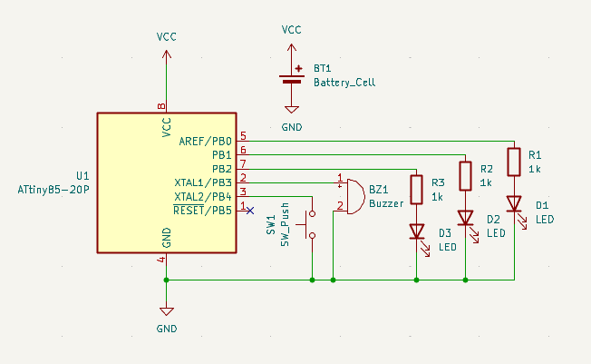
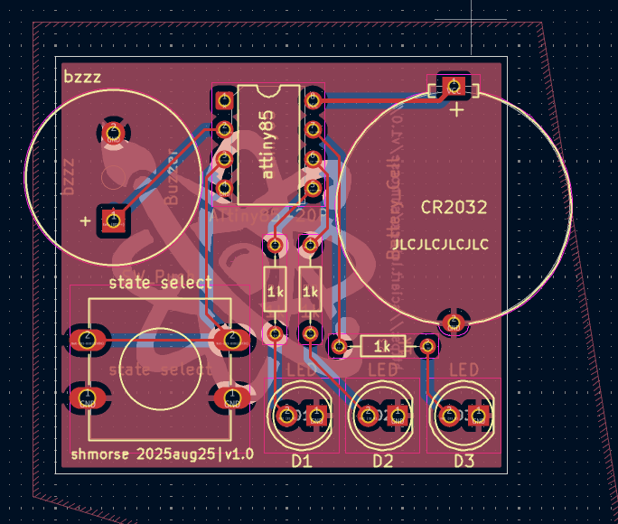
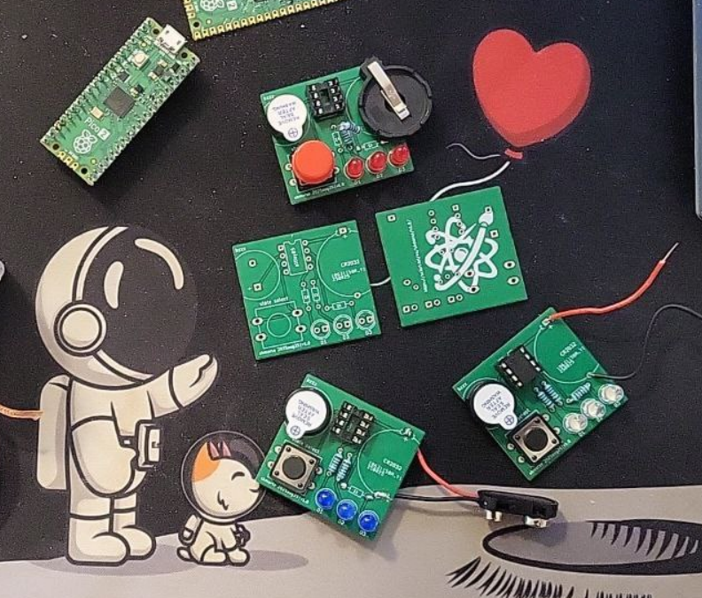

# Morse Code ATtiny85

Поупражняться с attiny85, светодиодами и пищалкой. В целом можно делать что угодно, но вообще идея что это что-то типа азбуки морзе, а кнопка это переключатель между состояниями.

Схема сделана в KiCad, вот отличный туториал который я использовал чтобы разобраться, как это делается: https://www.youtube.com/watch?v=vLnu21fS22s&list=PLUOaI24LpvQPls1Ru_qECJrENwzD7XImd

## Schematic

Собственно, схема. Никаких выключателей, только хардкор, только писк

## PCB Layout

Всё залито землёй, поэтому ножки которые идут на землю никуда не идут, _удобно!_

## Build Examples

Один из резисторов стоит неудобно, но в целом выкрутиться можно если не присоединять слот под батарейку.

## Компоненты
* Микроконтроллер ATtiny85-20P (ATtiny45 тоже подойдёт)
* 8-pin панелька под микросхему (можно без неё если не планируешь вынимать микроконтроллер)
* 3x 1kΩ резистора
* 3x 5mm светодиодов
* 1x 6x6mm кнопка
* 1x пищалка 12mm (растояние между ножек 7.5мм)
* 1x разъём под батарейку CR2032 -- :warning: в v1.0 нестандартное расстояние между ножек 20.5mm, возможно проще без него проводки к контактам припаять
